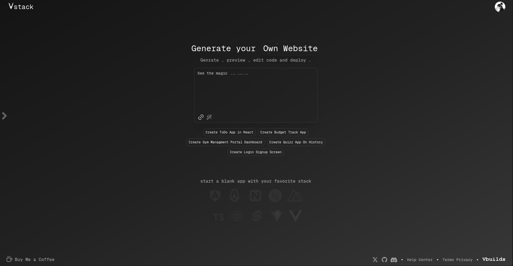
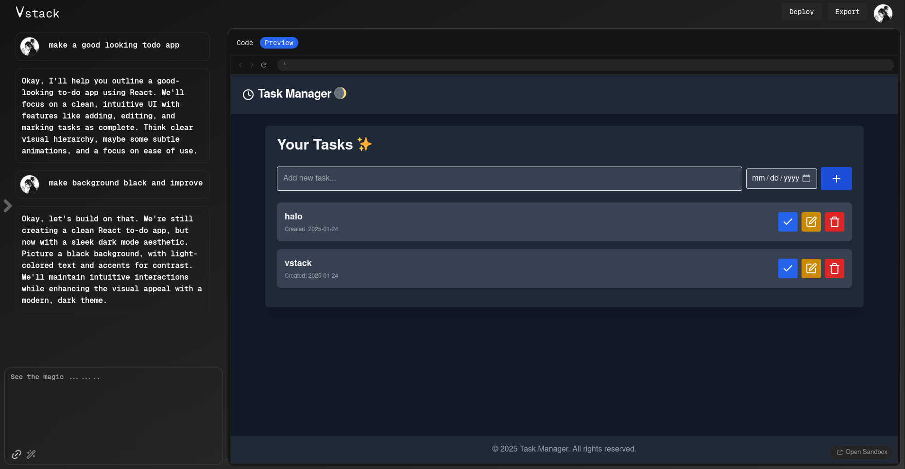

# VStack

Welcome to **VStack**, an AI-powered website generator that utilizes the power of Gemini AI to create stunning websites effortlessly. This application is built with the latest technologies including Auth.js Beta for authentication, Supabase for database management, Drizzle ORM for seamless data handling, and integrates with PayPal Payment Gateway for easy transactions.

## Features

    AI-Powered Website Generation: Generate websites quickly using Gemini AI.
    Secure Authentication: Integrated Auth.js Beta for user authentication.
    Real-Time Database: Supabase for fast and efficient database management.
    Database Handling: Drizzle ORM for easy interaction with your database.
    Payment Gateway: Integrates PayPal for simple and secure payments.
    Responsive Design: Fully responsive layout for a smooth experience across all devices.
    Minimalistic & Modern UI: A clean and modern design focused on user experience.

Screenshots

  

## Tech Stack

    Framework: Next.js
    Authentication: Auth.js Beta
    Database: Supabase
    ORM: Drizzle ORM
    Payment Gateway: PayPal API
    Styling: Tailwind CSS
    AI: Gemini AI (for website generation)

Rohit - rohitjaatjaat073@gmail.com

Project Link: https://github.com/SimplyRohit/vstack
